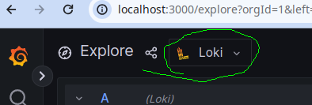
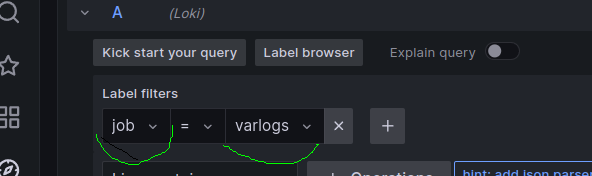
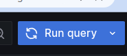
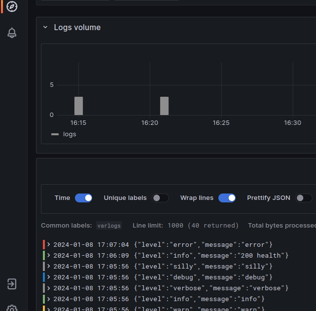

# Nodejs logging whit Grafana Loki playground

Este payground usa o Grafana e o Loki para vilusalização de logs do Nodejs.

### Instruções de execução:

Neste diretório nodejs-log-grafana-loki:

Execute o seguinte comando em um terminal Linux, para iniciar o Grafana e o Loki:

* **_docker compose up_**

Em outro terminal Linux, entre no diretório ***node-app*** e execute os seguintes comandos:

* **_npm install express_**

* **_npm install winston_**

Para inicializar a aplicação:

* **_node -r ./index.js_**

### Uso:

* Acesse a Grafana em: http://localhost:3000/explore

* Selecione o Loki como datasource: 

Em ***Label filters***, selecione:

Depois click em Run query:

O resultado da query deve ser algo assim:

Cada vez que a aplicação é iniciada ela já gera alguns logs padrões.
Também é possível gerar mais logs através dos links:

*  http://localhost:5556/200
*  http://localhost:5556/404
*  http://localhost:5556/health

### Referências

* Install Loki with Docker Compose: 

  https://grafana.com/docs/loki/latest/setup/install/docker/#install-with-docker-compose

* Grafana Loki documentation / Get started:

  https://grafana.com/docs/loki/latest/get-started/?pg=oss-loki&plcmt=resources#get-started

* Logger in Node Js Express Application

  https://www.youtube.com/watch?v=cWi7TAyVoZo

  https://github.com/basarbk/express-sequelize/tree/logging-final
